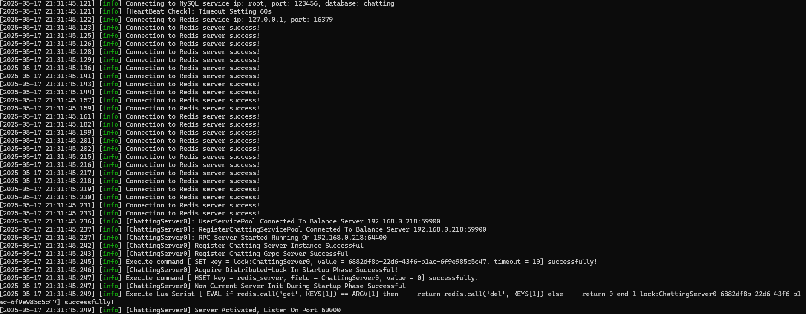
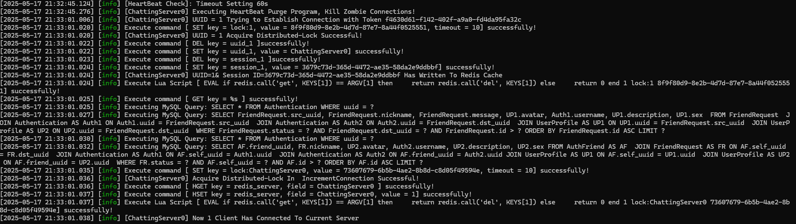

# Distributed-Instant-Messaging-System-Development

## 0x00 Description

Distributed-Instant-Messaging-System-Development is a real-time chat application built using C++17, Boost ~~FFmpeg, OpenGL~~  and gRPC, featuring a distributed TCP server architecture. ~~file transfer and Real time video streaming functionalities are still testing.~~

### **Frontend Development:**

- Developed a chat dialog using **Qt**, using `QListWidget` for an efficient chat record list and combining `QGridLayout` and `QPainter` for customized chat bubble styling to enhance the user experience.
- Encapsulated **Qt Network** modules to support HTTP and C/S service communication.
- Implemented core features such as adding friends, friend communication, chat record and chat record status display.
- ~~Integrated file transfer functionality to allow users to upload and download files.~~
- ~~Implemented an intuitive file management interface with drag-and-drop support.~~


**Backend Architecture Design:**

- Designed a distributed service architecture with the following components:

  - `**gateway-server**` **(Gateway Service):** Provides HTTP APIs to handle user login, registration, and authentication.
  - `**chatting-server**` **(Distributed Chatting Service):** Utilized ASIO to implement efficient TCP long connection communication.
  - `**balance-server**` **(Load Balancing Service):** Allocates chat services dynamically to achieve load balancing.
  - `**captcha-server**` **(Captcha Service):** Generates and validates captchas for enhanced security.
  - `**resources-server**` **(Distributed Resources Service):** Manages file storage, supporting file uploads and downloads.

- Enabled inter-service communication using the **gRPC protocol**, ensuring high availability and support for reconnections.

  

**High-Performance Optimization:**

- Implemented multithreading with `io_context` pools in the `chatting-server` to boost concurrent performance.
- Developed a **MySQL connection pool** to manage user data, friend relationships, and chat records.
- Designed a **Redis connection pool** for caching optimization.
- Built a **gRPC connection pool** to enhance distributed service access efficiency.


### File Transfer Features

- File transfers are managed using the `resources-server`.
- Implemented chunked file uploads to handle large files efficiently.
- Supported resumable uploads and downloads using unique identifiers shared by `chatting service`
- ~~Enhanced file security with authentication checks and encryption.~~


**Technical Highlights:**

- Gateway service provides **stateless HTTP interfaces** and integrates load balancing functionality.
- Chat service supports **asynchronous message forwarding** with reliable TCP long connections.
- Resources service supports **Flow Control** ~~and `RTMP` real time streaming protocol~~
- Achieved support for **8k~10k+ concurrent connections** on a single server.
- Support deferred connection cleanup process, ensuring all data are transmitted before closing the connection 


## 0x01 All Servers in this project

### Captcha-server

Captcha-server imported `ioredis`, `grpc-js`, `pproto-loader`, `nodemailer`, `uuidv4` libraries to the project.

#### Balance-server

Manages load balancing and server resource allocation.

### Resources-server

Responsible for storing user-uploaded files and ensuring secure file access.

### Chatting-server

1. User Login`(SERVICE_LOGINSERVER)`

2. User Logout`SERVICE_LOGOUTSERVER`

3. User Search For Peers`(SERVICE_SEARCHUSERNAME)`

4. Create Private Chat `Thread ID`(`SERVICE_CREATENEWPRIVATECHAT`)

5. Pull Chat Thread By Page`(SERVICE_PULLCHATTHREAD)`

6. Pull Chat Record By Page`(SERVICE_PULLCHATRECORD)`

7. User Who Initiated Friend Request `(SERVICE_FRIENDREQUESTSENDER)`

8. User Who Received Friend Request`(SERVICE_FRIENDREQUESTCONFIRM)`

9. **User** Sends Text Msg To It's Server`(SERVICE_TEXTCHATMSGREQUEST)`

10. **Server** verifies Text Msg and allocate a `Message ID` as a confirmation `(SERVICE_TEXTCHATMSGRESPONSE)`

11. **Server(It could be another server)** forwards Text Msg to target user `(SERVICE_TEXTCHATMSGICOMINGREQUEST)`

12. Client Terminal Sends Heart Beat`(SERVICE_HEARTBEAT_REQUEST)`

    

### Gateway-server

All services are using HTTP short connections, users are going to create a POST method to the gateway-server and gateway-server is going to respond to the client requests accordingly.

1. `/get_verification`

   User sends a email address to gateway-server and request to get a Email verification code(CPATCHA) request to server. server using **gRPC** protocol to communicate with NodeJS server(`captcha-server`) and create an unique **uuid** for the user. The **uuid** is going to store in a **Redis** memory database with a timeout setting, user should register the new account within the valid time or request for a new one instead.

2. `/post_registration`

   After request for a **valid CPATCHA**, user could trigger registration confirm button to post registration request to the server. Server will whether this user's identity is collision with any other user inside the system, if no collision found the info will be stored inside database. ~~however, SQL injection protection mechanism is still not available yet!~~

3. `/check_accountexists`

   After account registration, when user demands to change his/her password, we have to verifiy the account existance.

4. `/reset_password`

   After executing `/check_accountexists` process, then user could enter his/her new password info, and client terminal could send the new password info to the the server. server will do the similiar process in `/post_registration` and alter the existing data inside the database.

5. `/trylogin_server`

   please be careful, `trylogin_server` **could not login into** the real server directly. **It's a server relay!**

   The identification is similiar to `/check_accountexists` authenication process. The `gateway-server` will communicate with `balance-server` for the address of `chatting-server` by using **gRPC**, and `chatting-server` will do load-balancing and return the lowest load server info back. However, The user connection status **will not** maintained and managed by `gateway-server` and `gateway-server` doesn't care about this either, client will receive the real address of `chatting-server` and connecting to it by itself. ~~however, SQL injection protection mechanism is still not available yet!~~


## 0x02 Requirements

Ensure you have the following installed:

- **Docker** for container management

- **Redis** for caching

- **MySQL** for user and file metadata storage

- ~~**FFmpeg**~~

- ~~**OpenGL**~~

  

### 1. Basic Infrastructures

It's strongly suggested to use docker to build up those services ^_^. If you intended to pass a host directory, please use absolute path.

#### 1.1 Redis Memory Database

- Create a local volume on host machine and editing configuration files. **Please don't forget to change your password.**

  ```bash
  mkdir /absolute_path_to/conf/
  cp ./DistributedIMSystem/conf/redis.conf /absolute_path_to/conf/redis.conf
  ```
  
- Creating a `Redis` container and execute following commands.

  ```bash
  docker pull redis:7.2.4  #Pull the official docker image from Docker hub
  docker run \
      --restart always \
      -p 16379:6379 --name redis \
      --privileged=true \
      -v /absolute_path_to/conf/redis.conf:/etc/redis/redis.conf \
      -v /absolute_path_to/data:/data:rw \
      -d redis:7.2.4 redis-server /etc/redis/redis.conf \
      --appendonly yes
  ```

- Entering `Redis` container and access to command line `redis-cli`.

  ```bash
  docker exec -it redis bash  #entering redis
  redis-cli            #login redis db
  ```

  

#### 1.2 MySQL Database

- Create a local volume on host machine and editing configration files. **Please don't forget to change your password.**

  ```bash
  #if you are using windows, please download WSL2
  mkdir -p /absolute_path_to/mysql/{conf,data} 
  cp ./DistributedIMSystem/conf/mysql.cnf /absolute_path_to/conf/mysql.cnf
  ```
  
- Creating a `MySQL` container and execute following commands.

  ```bash
  docker pull mysql:8.0  #Pull the official docker image from Docker hub
  docker run --restart=on-failure:3 -d \
      -v /absolute_path_to/mysql/conf:/etc/mysql/conf.d \
      -v /absolute_path_to/data:/var/lib/mysql \
      -e MYSQL_ROOT_PASSWORD="your_password" \
      -p 3307:3306 --name "your_container_name" \
      mysql:8.0
  ```

- Entering `MySQL` container and access to `mysql` command line.

  ```bash
  docker exec -it "your_container_name" bash  #entering mysql
  mysql -uroot -p"your_password"                #login mysql db ( -u: root by default, -p password)
  ```

- Initialize `MySQL` database with following `SQL` commands to create DB and table schemas.

  ```bash
  ./DistributedIMSystem/conf/DistributedIMSystem.sql
  ```
  
  

### Servers' Configurations

Most of those basic configurations are using *.ini file, except `Captcha-server`.

#### Captcha-server**(config.json)**

#### Gateway-server**(config.ini)**

#### Balance-server**(config.ini)**

#### Chatting-server**(config.ini)**

#### Resources Server**(config.ini)**


## 0x03 Developer Quick Start

### Platform Support

Windows, Linux, MacOS(Intel & Apple Silicon M)

### Download and build Distributed-Instant-Messaging-System-Development

```bash
git clone https://github.com/Liupeter01/Distributed-Instant-Messaging-System-Development
git submodule update --init --recursive
```

### Build Distributed-Instant-Messaging-System-Development **Servers**

#### All C++ Based Server

```bash
cd Distributed-Instant-Messaging-System-Development
cmake -Bbuild -DCMAKE_BUILD_TYPE=Release -DCMAKE_INCLUDE_PATH=/usr/local/include -DCMAKE_CXX_FLAGS=-03
cmake --build build --parallel [x] --target all
```


#### Captcha Server

[Captcha-server](https://github.com/Liupeter01/captcha-server/blob/main/README.md)


### Build  Distributed-Instant-Messaging-System-Development  Client Application

[Chatting-client](https://github.com/Liupeter01/chatting-client/blob/main/README.md)


### How to Execute

#### Step1 - Activate Redis and MySQL service first

**[IMPORTANT]: you have to start those services first!!**

#### Step 2 - Execute LoadBalance-Server

```bash
.\build\debug\balance-server\LoadBalanceServer
```

#### Step3 - Execute Resources-Server and Chatting-Server

**[IMPORTANT]: If Chatting-server not started , then it will resulting in `NO_AVAILABLE_CHATTING_SERVER` ERROR**

```bash
.\build\debug\chatting-server\ChattingServer
.\build\debug\resources-server\ResourcesServer
```

#### Step3 - Execute Captcha-server

```bash
cd captcha-server
npm install
node index.js
```

#### Step4 - Execute Gateway-server

```bash
.\build\debug\gateway-server\GatewayServer
```


## 0x04 Error handling

### Error 1:  SyntaxError: Unexpected token  in JSON at position 0

```bash
SyntaxError: Unexpected token  in JSON at position 0
    at JSON.parse (<anonymous>)
```

Solving
please change your encoding method to UTF-8, especially for VSCode user

Referring Url
<https://stackoverflow.com/questions/55960919/nodejs-syntaxerror-unexpected-token-in-json-at-position-0>


### Error 2:  undefined symbol upb_alloc_global

```cmake
set(protobuf_BUILD_LIBUPB OFF)
```

Referring Url
<https://github.com/grpc/grpc/issues/35794>


### Error 3:  fatal error: 'unicode/locid.h' 'unicode/ucnv.h' file not found (usually happened on MacOS)

1. Download icu 74.1

   ```bash
   git clone https://github.com/unicode-org/icu.git
   ```

2. Compile and Install

   ```bash
   git clone https://github.com/unicode-org/icu.git
   cd icu/source
   ./configure && make -j[x]
   sudo make install
   ```

3. setup cmake variable

   ```bash
   cmake -Bbuild -DCMAKE_INCLUDE_PATH=/usr/local/include
   cmake --build build --parallel x
   ```

   

Referring Url
<https://unicode-org.github.io/icu/userguide/icu4c/build.html>


### Error 4: Boringssl undefined win32

```cmake
set(OPENSSL_NO_ASM ON)
```

Referring Url
<https://github.com/grpc/grpc/issues/16376>


### Error 5:  Handling gRPC issue

```bash
CMake Error: install(EXPORT "protobuf-targets" ...) includes target "libprotobuf-lite" which requires target "absl_node_hash_map" that is not in any export set.
```


#### Mitigation

```cmake
set(ABSL_ENABLE_INSTALL ON)
```

Referring Url
 <https://github.com/protocolbuffers/protobuf/issues/12185>
 <https://github.com/protocolbuffers/protobuf/issues/12185#issuecomment-1594685860>


### Error 6:  E No address added out of total 1 resolved

you have to start the main server first and then open nodejs service


### Error 7:  /EHsc` causing compile error issue

**Add those codes in front of FetchContent** to prevent inclusion issue.

```cmake
if(MSVC)
  message(STATUS "MSVC detected, enabling /EHsc")
  set(CMAKE_CXX_FLAGS
      "${CMAKE_CXX_FLAGS} /EHsc"
      CACHE STRING "MSVC exception flag" FORCE)
  add_compile_options(/EHsc)
endif()
```


## 0x05 Showcases

### Client

#### Main page


#### Logout


#### Register page


#### Search and add new contact(For Friending Request Sender)


#### Confirm to add new friend(For Friending request receiver)


#### File Transfer(Preview-only **NOT** integrated yet)

**Because of efficiency issue, Currently, there is no log system on resources-server**


#### Same account logged in from a different location

- expired login

  

- current login

  

#### Avatar Cropper


### Server

#### Gateway-server Initialize 


#### Gateway-server Login Status


#### Balance-server  Initialize 


#### Balance-server Token Register


#### Balance-server Handling other grpc servers' closing event


#### Chatting-server  Initialize 



#### Chatting-server Handling Login



#### Chatting-server Handling Logout


#### Same account logged in from a different location


#### Resources-server Initialize 


#### Captcha-server


